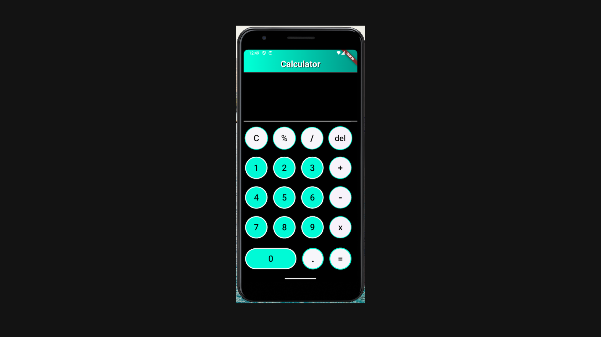

# Simple Calculator App (Flutter)

This is a basic calculator app built using **Flutter** and **Dart** in **Android Studio**. It allows users to perform simple arithmetic operations such as addition, subtraction, multiplication, and division.

## Features

- Addition  
- Subtraction  
- Multiplication  
- Division  
- Clean and user-friendly UI with vibrant colors  
- Fast and responsive interface  
- Works on Android devices

## Built With

- [Flutter](https://flutter.dev/)  
- [Dart](https://dart.dev/)  
- [Android Studio](https://developer.android.com/studio)

## Screenshots

